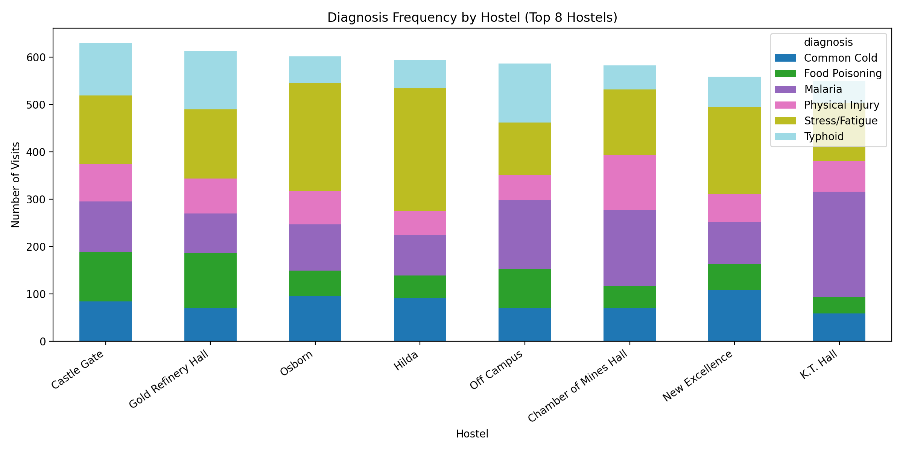
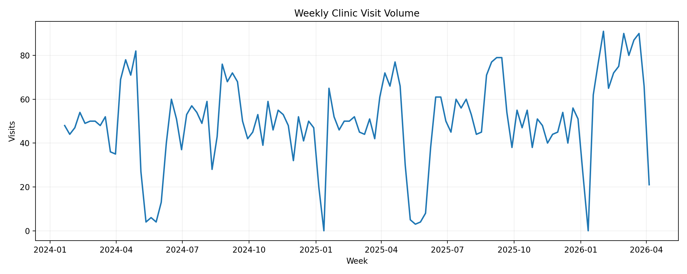
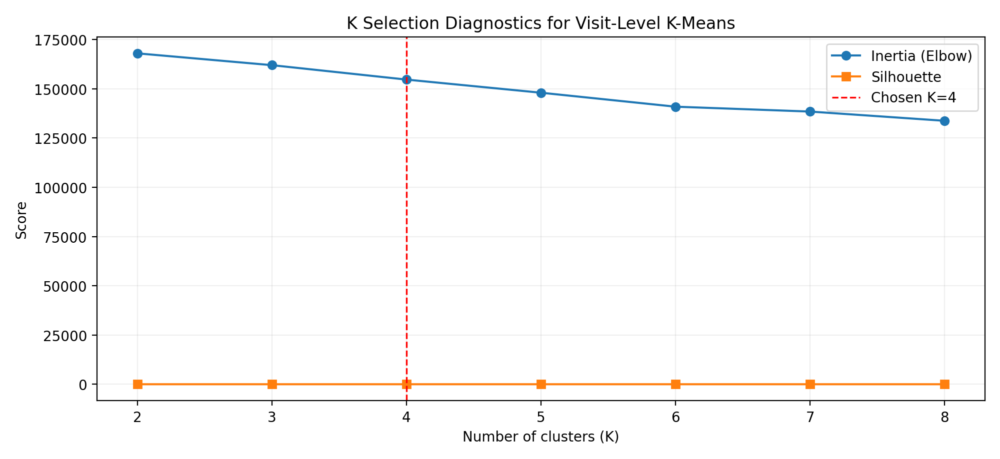
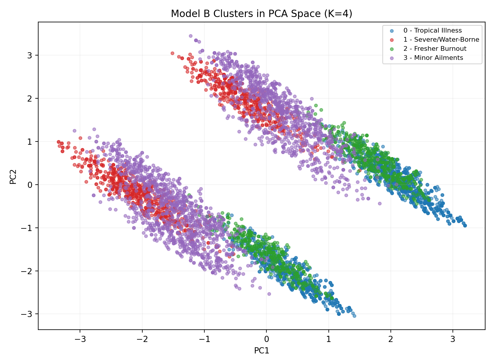
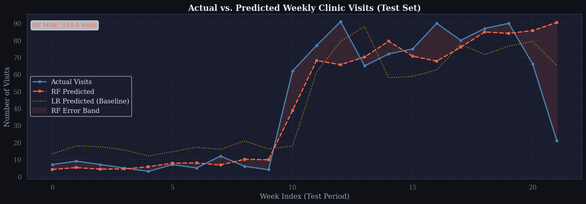

# UNIVERSITY OF MINES AND TECHNOLOGY (UMaT), TARKWA
## FACULTY OF COMPUTING AND MATHEMATICAL SCIENCES
## DEPARTMENT OF COMPUTER SCIENCE AND ENGINEERING


# A REPORT ON UNIMEDITREND
## Student Clinic Demand and Health-Pattern Analysis

**BY:** GROUP 8, CE 3A  
**COURSE TUTOR:** DR. ABDEL-FATAO HAMIDU  

This report is presented to Dr. Abdel-Fatao Hamidu, the course tutor for Artificial Intelligence in Engineering.


## TABLE OF CONTENTS
1. Abstract  
2. Introduction  
3. Problem and Objectives  
4. Dataset and Engineering  
4.1 Data Schema and Volume  
4.2 MongoDB Architecture  
4.3 Data Preprocessing and Cleaning  
5. Exploratory Data Analysis (EDA)  
6. Clustering (K-Means)  
6.1 Model A: Hostel Risk Profiling  
6.2 Model B: Visit Archetype Discovery  
6.3 Cluster Validation and Operational Meaning  
7. Forecasting (Supervised)  
7.1 Feature Engineering  
7.2 Validation Strategy  
8. Results and Discussion  
8.1 Forecasting Performance (Holdout Set)  
8.2 5-Fold TimeSeriesSplit (Random Forest)  
9. Deployment  
10. Limitations and Ethics  
11. Conclusion  
12. Future Work  
13. Acknowledgements  
14. References and Appendix  
14.1 References  
14.2 Appendix: Reproducibility Snapshot  
14.3 Appendix: Library Versions  
14.4 Appendix: Reproducibility Code Snippet

---

## 1. ABSTRACT
The UniMediTrend AI project is a comprehensive healthcare analytics pipeline engineered to bridge the gap between raw clinical records and strategic decision support in a university environment. By integrating data engineering, unsupervised segmentation, and supervised temporal forecasting, the project provides a reproducible blueprint for planning and managing student clinic operations. The architecture follows a deliberate progression from acquisition and storage to exploratory intelligence, pattern discovery, demand estimation, and deployment packaging.

At its core, UniMediTrend applies a dual-clustering strategy to isolate both hostel-level health-risk profiles and visit-level behavioral archetypes. This is combined with a short-horizon weekly forecasting engine to support staffing and inventory decisions. The analysis uses a synthetic high-volume dataset to preserve privacy while retaining statistical complexity. In practical terms, the pipeline reveals high-acuity residential zones, identifies behavior-linked visit patterns, and converts observed trends into forward-looking planning signals.

Although forecasting performance in the reported experiment remains an iterative target, the framework itself is technically robust, auditable, and deployment-ready. With artifact serialization and stateless inference paths, UniMediTrend demonstrates how AI research can be translated into a production-oriented clinic planning tool for evidence-based decisions.

---

## 2. INTRODUCTION
In university healthcare systems, demand variability is not random noise. It is shaped by recurring academic stress cycles, seasonal disease factors, mobility patterns, and environmental exposure. Conventional retrospective reporting provides historical summaries, but it does not offer enough lead time for proactive staffing, medicine procurement, and preventive intervention planning.

UniMediTrend addresses this gap through a structured and reproducible workflow:

**Data -> Clustering -> Forecasting -> Deployment**

This design ensures feature continuity across stages and transforms fragmented clinic records into coherent operational intelligence. Instead of treating data analysis as a one-off reporting activity, the project frames analytics as an engineering pipeline where each stage feeds the next with traceable outputs.

### 2.1 Pipeline / Methodology Diagram
```mermaid
flowchart LR
    A[Raw or Synthetic Clinic Records] --> B[Data Cleaning and Standardization]
    B --> C[EDA: Distribution and Temporal Diagnostics]
    C --> D1[K-Means Model A: Hostel Risk Profiling (K=3)]
    C --> D2[K-Means Model B: Visit Archetype Discovery (K=4)]
    B --> E[Weekly Aggregation + Temporal Features]
    E --> F[Supervised Forecasting Models]
    D1 --> G[Enriched Collection in MongoDB]
    D2 --> G
    F --> H[Serialized Artifacts: model, scaler, feature schema]
    G --> I[Dashboard Inference Layer]
    H --> I
    I --> J[Operational Decisions: Staffing, Inventory, Outreach]
```

The above flow formalizes how descriptive and predictive components are connected in a deployable system.

---

## 3. PROBLEM AND OBJECTIVES
The central operational problem in a campus clinic is **demand-resource mismatch**. If demand is underestimated, the clinic risks medication stockouts, queue congestion, and reduced quality of care. If demand is overestimated, scarce resources are underutilized and costs rise inefficiently.

To reduce this mismatch, UniMediTrend was developed around four explicit objectives:

1. **Idempotent Data Storage:** Build a robust persistence layer with MongoDB to preserve lineage, support safe reruns, and maintain auditability.
2. **Latent Pattern Discovery:** Use unsupervised clustering to reveal hidden structure in hostel-level risk distributions and visit-level behavior.
3. **Short-Horizon Demand Estimation:** Train supervised regression models for weekly visit-volume prediction.
4. **Inference Artifact Export:** Serialize model and preprocessing artifacts for real-time dashboard inference without retraining at runtime.

Collectively, these objectives shift clinic planning from reactive crisis response to proactive evidence-driven management.

---

## 4. DATASET AND ENGINEERING
A reliable healthcare analytics pipeline requires strict data lineage and controlled feature semantics. To satisfy privacy constraints while enabling robust experimentation, UniMediTrend uses a synthetic dataset generated with realistic domain patterns (academic cycles, seasonal effects, and diagnosis tendencies).

### 4.1 Data Schema and Volume
The project pipeline works with **5,799 clinic records** generated over multiple academic phases. For supervised forecasting, records are aggregated into weekly counts to form temporal modeling rows.

| Feature | Description | Data Type |
|---|---|---|
| visit_date | Primary timestamp for each clinic visit | DateTime |
| diagnosis | Medical condition category | Categorical |
| severity | Clinical intensity score | Numeric |
| hostel | Student residential location | Categorical |
| level | Academic level/year | Categorical/Numeric |
| gender | Demographic category | Categorical |
| department | Academic program affiliation | Categorical |

The schema supports both micro-level visit analysis and macro-level weekly demand forecasting.

### 4.2 MongoDB Architecture
The persistence strategy follows a **Raw vs Enriched** separation pattern:

- **Raw collection:** immutable baseline records (source of truth).
- **Enriched collection:** engineered fields, cluster labels, and model-facing features.

This design enforces stateless processing and idempotency. Engineers can rerun enrichment pipelines, update labels, and version models without corrupting baseline records. The architecture is therefore suitable for iterative AI workflows where features and models evolve over time.

### 4.3 Data Preprocessing and Cleaning
A complete data engineering report must state preprocessing explicitly. The following steps are applied before analysis/modeling:

1. **Date parsing and normalization** to enforce valid datetime format.
2. **Categorical text normalization** for hostel and diagnosis naming consistency.
3. **Duplicate checks** on key visit identifiers to prevent repeated observations.
4. **Missing-value policy**:
   - invalid critical fields (e.g., date or diagnosis) are excluded,
   - non-critical missing categorical values are imputed as `Unknown`.
5. **Type enforcement** for numerical fields such as severity and derived temporal attributes.
6. **One-hot encoding** for categorical features used in clustering and supervised tasks.
7. **Scaling** with StandardScaler where distance-based algorithms or linear models require normalization.
8. **Weekly aggregation** for forecasting target construction.
9. **PCA projection** for Model B cluster visualization and compact geometric analysis.

This pipeline ensures reproducibility and guards against leakage and schema drift.

---

## 5. EXPLORATORY DATA ANALYSIS (EDA)
EDA provides the empirical basis for choosing model classes and feature engineering strategy. The analysis sought to answer:

- Are diagnosis patterns hostel-dependent?
- Is temporal demand stable or cyclical?
- Do patterns justify temporal features and unsupervised segmentation?

The findings confirmed non-random distribution structures and temporal variability linked to academic and seasonal cycles.

### Figure 5.1 Diagnosis Frequency by Hostel


This chart reveals unequal illness burden distribution across hostels, supporting targeted intervention policies rather than uniform outreach.

### Figure 5.2 Weekly Visit Volume Time Series


The time-series profile shows variability and burst periods, validating the use of lag features, smoothing terms, and cyclical encodings in forecasting.

In practical terms, EDA establishes that clinic demand and diagnosis burden are structured signals, not random fluctuations.

---

## 6. CLUSTERING (K-MEANS)
Unsupervised learning is used to convert high-volume records into operationally meaningful segments.

### 6.1 Model A: Hostel Risk Profiling
The hostel-level profile matrix was clustered with **K=3** (**Silhouette: 0.3889** in the executed notebook run). Each hostel profile captures diagnosis mix proportions, severity tendency, and activity intensity.

Resulting strategic tiers:

1. **High-Acuity / Malaria Risk**
2. **Food/Water-Borne Zone**
3. **Academic Burnout Zone**

These tiers can support differentiated outreach such as sanitation checks, anti-malaria campaigns, and stress-management programming.

### 6.2 Model B: Visit Archetype Discovery
The visit-level feature space was clustered with **K=4** (executed notebook silhouette: **0.1267**). Features were one-hot encoded, scaled, and projected for visualization.

Archetypes identified:

1. Cluster 0: Tropical Illness
2. Cluster 1: Severe/Water-Borne
3. Cluster 2: Fresher Burnout
4. Cluster 3: Minor Ailments

| Cluster ID | Final Label | Interpretation |
|---|---|---|
| 0 | Tropical Illness | Malaria- and tropical-condition dominant visits |
| 1 | Severe/Water-Borne | More severe and water/food-borne condition profile |
| 2 | Fresher Burnout | Visits linked to fresher pressure and stress fatigue patterns |
| 3 | Minor Ailments | Lower-acuity routine clinic cases |

Although geometric separation is weaker than Model A, this archetype layer remains useful for communication and triage strategy.

### 6.3 Cluster Validation and Operational Meaning
To justify K choice and cluster credibility, both K diagnostics and visual separation were included.

### Figure 6.1 Elbow and Silhouette Curve


This plot shows how inertia and silhouette evolve across candidate K values, supporting the selected K for Model B.

### Figure 6.2 PCA Scatter Plot for Model B Clusters


Overlap is visible, which explains the moderate silhouette score. Operationally, moderate overlap does not eliminate value; it indicates mixed-case real-world visit behavior rather than perfectly separable categories.

---

## 7. FORECASTING (SUPERVISED)
To support staffing and inventory planning, weekly demand is modeled as a supervised regression problem.

### 7.1 Feature Engineering
The feature set captures both short-term momentum and cyclical structure:

1. **Lag terms:** lag_1, lag_2, lag_3
2. **Smoothing:** rolling_mean_4
3. **Cyclical encodings:** month_sin, month_cos, week_sin, week_cos

These features let the model represent recurrence and short memory without violating chronological integrity.

### 7.2 Validation Strategy
The validation strategy prioritizes time-order correctness:

1. **Chronological holdout split (80/20)** to avoid look-ahead leakage.
2. **5-fold TimeSeriesSplit** to test consistency across rolling windows.

This design provides both a clean final holdout estimate and robustness diagnostics across different time blocks.

---

## 8. RESULTS AND DISCUSSION
Results are presented with transparency and interpreted in a planning context.

### 8.1 Forecasting Performance (Holdout Set)
| Metric | Linear Regression | Random Forest |
|---|---:|---:|
| MAE | 16.69 | 16.93 |
| RMSE | 19.46 | 20.90 |
| R2 | 0.0741 | -0.0689 |

### Figure 8.1 Actual vs Predicted Weekly Visits


The chart makes the underfit/generalization issue visible and complements the metric table.

### 8.2 5-Fold TimeSeriesSplit (Random Forest)
| Metric | Mean | Standard Deviation |
|---|---:|---:|
| MAE | 11.90 | 4.19 |
| RMSE | 14.69 | 4.59 |
| R2 | -0.0477 | 0.6314 |

**Interpretation:**

1. Holdout performance is mixed: Linear Regression achieved a small positive R2, while Random Forest remained slightly below naive baseline performance.
2. High fold variance suggests unstable temporal generalization across academic sub-cycles.
3. This is best interpreted as a diagnostic finding, not a system failure.
4. The likely explanatory gap is missing exogenous signals (weather, exam calendar intensity, public health events).

Therefore, the forecasting stage currently provides structural groundwork and evaluation discipline, while accuracy improvement remains a planned iteration target.

---

## 9. DEPLOYMENT
UniMediTrend is designed to move from notebook experimentation to operational use via serialized inference assets.

The deployment package includes:

1. Trained model files (`.pkl`)
2. Scalers and transform artifacts
3. Feature schema metadata (`.json`)

Stateless inference sequence:

1. Fetch latest counts/features from enriched MongoDB collection.
2. Apply serialized preprocessing transformations.
3. Run model inference.
4. Display planning output on dashboard for weekly decisions.

This architecture supports model versioning and safe update cycles without forcing retraining at runtime.

---

## 10. LIMITATIONS AND ETHICS
### Technical Limitations
1. Synthetic data may not fully represent real administrative irregularities.
2. K-Means assumes spherical geometry, which can reduce fit quality for complex manifolds.
3. Forecasting is currently constrained by limited exogenous covariates.

### Ethical Mandate
1. Hostel-based risk labels must be used only for supportive action, never stigmatization.
2. Health records require strict access control and governance.
3. Model outputs are advisory; final operational decisions must remain clinician-validated.

This clinician-in-the-loop stance is critical for responsible AI use in healthcare-adjacent systems.

---

## 11. CONCLUSION
UniMediTrend successfully demonstrates an end-to-end AI-in-Engineering lifecycle for campus clinic analytics. The project establishes auditable data foundations, extracts high-value segmentation insights, and applies transparent forecasting evaluation protocols. Even where predictive performance remains a development challenge, the pipeline already delivers strategic value through structured risk profiling, archetype discovery, and reproducible deployment design.

In effect, UniMediTrend provides a credible operational intelligence scaffold that can be improved incrementally as richer data sources are integrated.

---

## 12. FUTURE WORK
The UniMediTrend v2.0 roadmap focuses on closing the predictive gap and strengthening production reliability:

1. Integrate exogenous signals (weather, humidity/rainfall, exam calendar).
2. Evaluate advanced non-linear estimators (XGBoost, LightGBM).
3. Add probabilistic forecasting intervals for uncertainty-aware planning.
4. Implement drift monitoring and retraining triggers.
5. Validate on anonymized real-world clinic data.
6. Extend fairness and subgroup error analysis across hostel, department, and demographic slices.

---

## 13. ACKNOWLEDGEMENTS
The group sincerely acknowledges **Dr. Abdel-Fatao Hamidu** for his supervision, technical guidance, and continuous academic support throughout this project. We also appreciate the institutional support of the **Department of Computer Science and Engineering** and the **University of Mines and Technology (UMaT), Tarkwa** for providing the environment in which this work was completed.

---

## 14. REFERENCES AND APPENDIX
### 14.1 References
1. Pedregosa, F., Varoquaux, G., Gramfort, A., Michel, V., Thirion, B., Grisel, O., et al. (2011). Scikit-learn: Machine Learning in Python. *Journal of Machine Learning Research*, 12, 2825-2830.
2. MongoDB, Inc. (2026). Data Modeling and CRUD Operations Documentation.
3. Hyndman, R. J., and Athanasopoulos, G. (2021). *Forecasting: Principles and Practice* (3rd ed.). OTexts.
4. Bishop, C. M. (2006). *Pattern Recognition and Machine Learning*. Springer.
5. Hastie, T., Tibshirani, R., and Friedman, J. (2009). *The Elements of Statistical Learning* (2nd ed.). Springer.
6. Breiman, L. (2001). Random Forests. *Machine Learning*, 45(1), 5-32.
7. Kaufman, L., and Rousseeuw, P. J. (1990). *Finding Groups in Data: An Introduction to Cluster Analysis*. Wiley.
8. Box, G. E. P., Jenkins, G. M., and Reinsel, G. C. (2015). *Time Series Analysis: Forecasting and Control* (5th ed.). Wiley.
9. Goodfellow, I., Bengio, Y., and Courville, A. (2016). *Deep Learning*. MIT Press.

### 14.2 Appendix: Reproducibility Snapshot
| Item | Metric/Value |
|---|---|
| Language | Python |
| Persistence Layer | MongoDB |
| Total Clinic Records | 5,799 |
| Aggregated Modeling Rows | 79 (reported experiment setup) |
| Random State | 42 |
| Validation Method | Chronological Holdout + TimeSeriesSplit |

### 14.3 Appendix: Library Versions
| Library | Version |
|---|---|
| pandas | 3.0.2 |
| numpy | 2.4.4 |
| scikit-learn | 1.8.0 |
| matplotlib | 3.10.8 |

### 14.4 Appendix: Reproducibility Code Snippet
```python
import pandas as pd
from generate_dataset import generate_dataset

df = generate_dataset()
df["visit_date"] = pd.to_datetime(df["visit_date"])
weekly = df.set_index("visit_date").resample("W").size().reset_index(name="total_visits")

print("Total records:", len(df))
print("Weekly aggregates:", len(weekly))
```

---

### Figure Checklist Added to This Version
1. EDA hostel-diagnosis chart: `report_assets/eda_diagnosis_by_hostel.png`
2. EDA weekly visits chart: `report_assets/eda_weekly_visits.png`
3. Cluster elbow/silhouette diagnostics: `report_assets/cluster_k_selection_curve.png`
4. PCA cluster scatter (Model B): `report_assets/cluster_model_b_pca_scatter.png`
5. Actual-vs-predicted forecast chart: `actual_vs_predicted.png`

This version is expanded and detailed, with the missing sections and visual evidence integrated directly into the report narrative.
