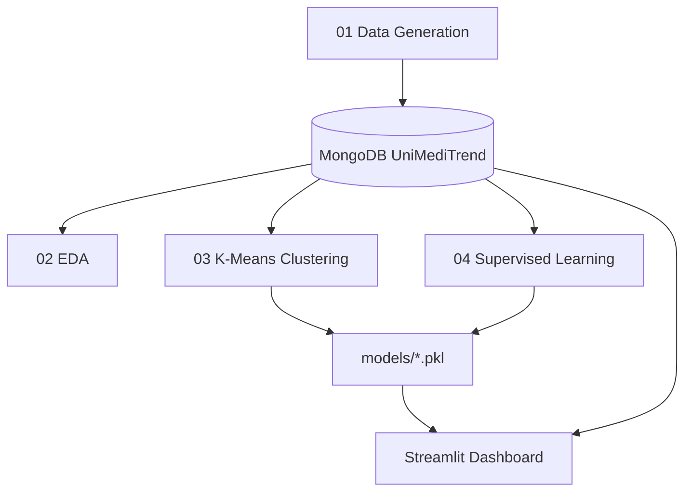

# UniMediTrend

**UMaT student clinic health analytics** — end-to-end data science pipeline with EDA, K-Means clustering, supervised weekly demand forecasting, and a Streamlit dashboard for hostel risk profiling and visit prediction.

Academic project (Group 8, CE 3A) using synthetic, privacy-safe clinic visit data.

---

## Table of Contents

- [System Design](#system-design)
- [Features](#features)
- [Technology Stack](#technology-stack)
- [Getting Started](#getting-started)
- [Configuration](#configuration)
- [Deployment](#deployment)
- [Project Structure](#project-structure)
- [License](#license)

---

## System Design

A **notebook-driven ML pipeline** ingests synthetic clinic data into MongoDB, runs EDA and clustering, trains supervised models, and serves predictions through a **Streamlit dashboard** that loads serialized `.pkl` artifacts.



| Stage | Artifact |
|-------|----------|
| **01** | Generate dataset, populate `clinic_logs` → `clinic_logs_enriched` |
| **02** | Exploratory analysis and visualizations |
| **03** | K-Means: hostel risk profiles, visit archetypes |
| **04** | Supervised weekly demand forecasting |
| **Dashboard** | Interactive UI: overview, risk analysis, forecast, CRUD |

---

## Features

- Synthetic clinic visit data generation with MongoDB ingestion
- EDA notebooks with Plotly/Matplotlib/Seaborn visualizations
- K-Means clustering for hostel risk and visit pattern archetypes
- Supervised learning for weekly visit demand forecasting
- **Streamlit dashboard** with four views:
  - Health Overview
  - Hostel Risk Analysis
  - Visit Demand Forecast
  - Data Management (view/add/edit/delete)
- PDF report generation and submission checklist

---

## Technology Stack

| Component | Technology |
|-----------|------------|
| Language | Python 3 |
| Dashboard | Streamlit |
| Database | MongoDB (local) |
| ML | scikit-learn, joblib |
| Data | pandas, numpy |
| Visualization | plotly, matplotlib, seaborn |
| Notebooks | Jupyter |
| Reports | fpdf2 |

---

## Getting Started

### Prerequisites

- Python 3.8+
- MongoDB running locally (`mongod` on port 27017)
- Jupyter (for running notebooks)

### Setup and run

```bash
python -m venv .venv
.\.venv\Scripts\Activate        # Windows
pip install -r requirements.txt

# 1. Start MongoDB
# 2. Run notebooks in order: 01 → 02 → 03 → 04
#    (populates DB and trains models/)

# 3. Launch dashboard:
streamlit run Dashboard\app.py --server.port 8501
# → http://localhost:8501
```

> **Note:** `start_app.bat` may reference an old folder path — update if needed.

---

## Configuration

MongoDB connection is hardcoded in `Dashboard/database.py`:

| Setting | Value |
|---------|-------|
| URL | `mongodb://localhost:27017/` |
| Database | `UniMediTrend` |
| Collection | `clinic_logs_enriched` |

For production or Streamlit Cloud, externalize the connection string to an environment variable and point to MongoDB Atlas.

---

## Deployment

| Environment | Approach |
|-------------|----------|
| **Local** | MongoDB + Streamlit (default) |
| **Streamlit Cloud** | Deploy `Dashboard/app.py` + host models; use MongoDB Atlas |
| **Inference** | Serialized `.pkl` models + `feature_cols.json` for stateless prediction |

No Docker configuration included.

---

## Project Structure

```
uni-meditrend/
├── 01_Data_Generation_and_DB_Setup.ipynb
├── 02_EDA_and_Visualisation.ipynb
├── 03_KMeans_Clustering.ipynb
├── 04_Supervised_Learning.ipynb
├── generate_dataset.py
├── models/                    # Trained .pkl artifacts
├── Dashboard/
│   ├── app.py                 # Streamlit entry point
│   ├── database.py
│   └── models/
├── requirements.txt
├── snapshots/                 # CSV snapshots
└── PROJECT_REPORT.md
```

---

## License

Academic project — see repository for usage terms.
